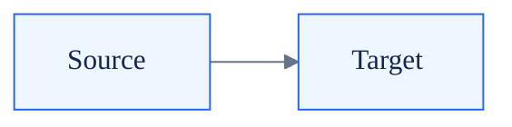

# Markdown + Mermaid Artifacts

Default to Markdown. Add Mermaid only when a diagram makes the decision, flow, dependency, or timeline easier to understand than prose.

## Core Contract

- Markdown is the source artifact; rendered diagrams are derived.
- Use Mermaid for structure, not decoration.
- Prefer one focused diagram over one large diagram.
- Use light, repeatable styling; do not invent a new visual language per artifact.
- Validate Mermaid before handing off important docs.

## Diagram Choice

| Need | Use |
| --- | --- |
| Architecture/data flow | `flowchart LR` with subgraphs |
| Temporal API/service interaction | `sequenceDiagram` |
| State lifecycle | `stateDiagram-v2` |
| Database/domain relationships | `erDiagram` or `classDiagram` |
| Schedule/migration phases | `gantt` or `timeline` |
| Decision tree/process | `flowchart TD` |

If a diagram has more than 12 nodes or 20 edges, split it into multiple named diagrams.

## Writing

MANDATORY READ `references/writing.md` before producing any Markdown artifact longer than a few paragraphs. Covers scannability, heading conventions, decision records, callouts, and anti-patterns based on *Don't Make Me Think* principles.

## Styling

MANDATORY READ `references/styling.md` before creating polished diagrams or when the user complains Mermaid looks ugly.

Use Mermaid frontmatter config, not deprecated `%%{init}%%` directives, for diagram-specific theme settings.

Default style set:



## Validation

MANDATORY READ `references/validation.md` before validating or adding validation to a repo.

Run:

```bash
/home/estifanos/.agents/skills/markdown-artifacts/scripts/validate-mermaid-md path/to/doc.md
```

The script extracts ```mermaid fences from Markdown, renders each one with `mmdc`, and fails on syntax/render errors. It also accepts `.mmd` files directly.

## NEVER

- **NEVER use Mermaid when bullets communicate the same thing.**
  **Why:** diagrams add syntax and validation cost.
  **Instead:** keep simple lists and tables in Markdown.

- **NEVER hand off unvalidated Mermaid in important artifacts.**
  **Why:** agents often produce diagrams that look plausible but fail to render.
  **Instead:** run `scripts/validate-mermaid-md` or state that validation was not run.

- **NEVER use per-diagram random colors, gradients, icons, or elaborate styling.**
  **Why:** style drift makes artifacts inconsistent and harder to scan.
  **Instead:** use the approved class set from `references/styling.md`.

- **NEVER create HTML, MDX, json-render specs, or mini-apps unless interaction or visual comparison is essential.**
  **Why:** richer formats create maintenance, review, and consistency costs.
  **Instead:** default to Markdown + Mermaid and use HTML only as an explicit escape hatch.
