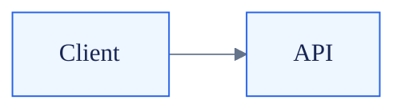
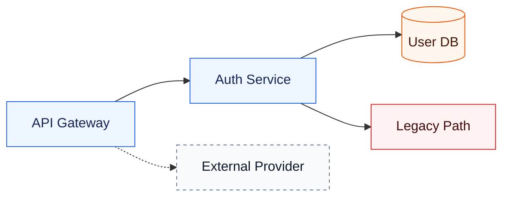
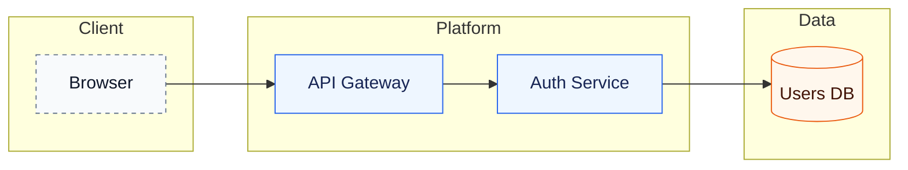
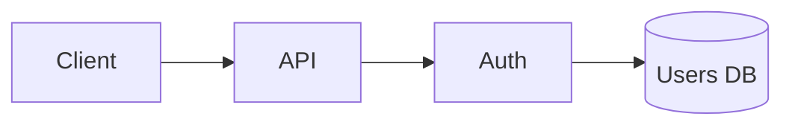

# Mermaid Styling Reference

## Use frontmatter config

Mermaid directives like `%%{init: ...}%%` are deprecated in Mermaid v10.5+. Use frontmatter config inside the Mermaid fence.

`theme: base` is required for custom `themeVariables`; Mermaid's other built-in themes are not customizable.

## Approved class vocabulary

Use these classes consistently across flowcharts.

Class meanings:

| Class | Use |
| --- | --- |
| `primary` | first-party services/components |
| `data` | databases, queues, object stores |
| `risk` | fragile, legacy, blocked, or dangerous paths |
| `success` | target state, completed path, validated branch |
| `neutral` | supporting nodes |
| `external` | third-party systems or outside boundaries |

## Layout rules

- Use `flowchart LR` for architecture and data flow.
- Use `flowchart TD` for decision trees and processes.
- Use subgraphs for ownership/boundaries, not decoration.
- Keep edge labels short: 1–4 words.
- Prefer semantic node IDs (`AuthService`) and readable labels (`Auth Service`).
- Split diagrams that require crossing edges to understand.

## Subgraph pattern

## Accessibility

Add `accTitle` and `accDescr` for diagrams that will be shared broadly.

## Avoid

- More than six colors.
- Multiple class vocabularies in one document.
- Long paragraphs inside nodes.
- HTML labels unless required by the renderer.
- Styling every edge individually.
